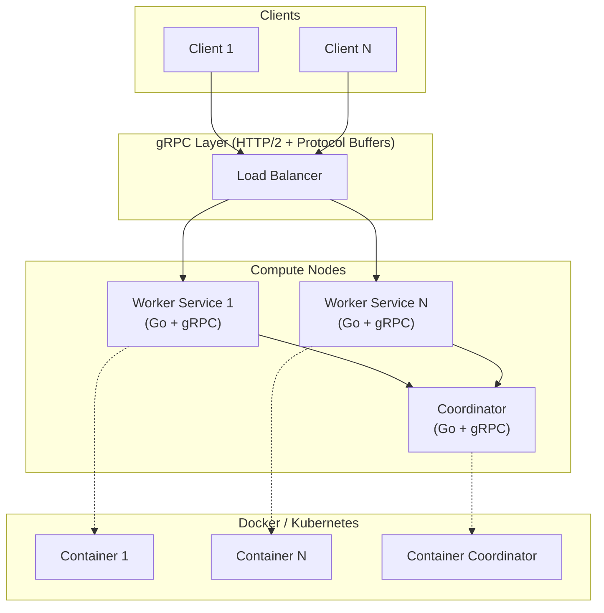

# Arquitectura - Decisiones Técnicas y Trade-offs

## Resumen Ejecutivo

Este documento describe las decisiones arquitectónicas principales del proyecto **DistributedProcessing** y los trade-offs evaluados en cada elección. El proyecto implementa un sistema de procesamiento distribuido utilizando Go, gRPC y Docker.

---

## 1. ¿Por qué Go?

### Decisión
Go (Golang) fue seleccionado como el lenguaje principal para implementar el sistema de procesamiento distribuido.

### Justificación

#### 1.1 Concurrencia Nativa
- **Goroutines**: Go proporciona goroutines, que son threads ligeros manejados por el runtime.
- **Eficiencia**: Miles o millones de goroutines pueden ejecutarse simultáneamente sin el overhead de threads del SO.
- **Caso de uso**: Ideal para sistemas distribuidos que manejan múltiples conexiones concurrentes.

#### 1.2 Compilación a Binario Estático
- **Distribución Simple**: Go compila a un único binario ejecutable sin dependencias externas.
- **Contenedorización**: Perfecta para Docker, reduciendo el tamaño de imágenes.
- **Despliegue**: Facilita la distribución a múltiples nodos sin problemas de versiones de librerías.

#### 1.3 Performance
- **Velocidad**: Go es casi tan rápido como C/C++ pero mucho más fácil de mantener.
- **Bajo Consumo de Memoria**: Ideal para sistemas con recursos limitados.
- **Latencia Predecible**: El garbage collector está optimizado para baja latencia.

#### 1.4 Excelente Ecosistema para Sistemas Distribuidos
- **gRPC**: Soporte nativo y de primera clase.
- **Librerías de red**: `net`, `net/http`, `context` muy robustas.
- **Testing**: Herramientas integradas para testing concurrente.

### Trade-offs

| Aspecto | Ventaja | Desventaja |
|--------|---------|-----------|
| **Curva de Aprendizaje** | Sintaxis simple, fácil de aprender | Si el equipo viene de OOP, requiere cambio de paradigma |
| **Ecosystem** | Grande para sistemas distribuidos | Menos librerías que Python/Java para ML/IA |
| **Tipado** | Tipado estático = mejor seguridad | Menos flexible que lenguajes dinámicos |

### Alternativas Evaluadas
- **Python**: Más lento, overhead de GIL para concurrencia real.
- **Java**: Pesado (JVM), mayor consumo de memoria.
- **Rust**: Más seguro, pero curva de aprendizaje más pronunciada.

---

## 2. ¿Por qué gRPC?

### Decisión
gRPC fue seleccionado como el protocolo RPC (Remote Procedure Call) para la comunicación entre servicios distribuidos.

### Justificación

#### 2.1 Eficiencia
- **Protocol Buffers (protobuf)**: Serialización binaria compacta y rápida.
- **HTTP/2**: Multiplexing nativo, permitiendo múltiples streams en una sola conexión.
- **Bandwidth**: Reduce significativamente el ancho de banda comparado con REST/JSON.

#### 2.2 Rendimiento
- **Latencia Baja**: Ideal para comunicación entre servicios de alta frecuencia.
- **Throughput Alto**: Manejo eficiente de múltiples peticiones simultáneas.
- **Comparación HTTP/REST**: gRPC es típicamente 10-100x más rápido que REST para carga de datos.

#### 2.3 Tipado Fuerte
- **Contratos Claros**: Los archivos `.proto` definen interfaces de servicio explícitamente.
- **Validación**: Los mensajes se validan automáticamente según su definición.
- **Generación de Código**: Eliminación automática de serialización manual.

#### 2.4 Bidireccional por Defecto
- **Streaming**: Soporte nativo para server-push y client-push streams.
- **Comunicación Duplex**: Posibilita patrones de mensajería más complejos.

### Trade-offs

| Aspecto | Ventaja | Desventaja |
|--------|---------|-----------|
| **Curva de Aprendizaje** | Potente y eficiente | Requiere aprender Protocol Buffers |
| **Debugging** | Tipado fuerte = errores claros | Mensajes binarios, no legibles en texto plano |
| **Browser** | No requiere HTTP/1.1 | No soporta directamente llamadas desde navegador (sin gRPC-Web) |
| **Ecosistema REST** | Herramientas especializadas | Menos omnipresente que REST en todos los lenguajes |

### Alternativas Evaluadas
- **REST/JSON**: Más simple, pero menos eficiente para comunicación de alta frecuencia.
- **GraphQL**: Más flexible, pero overhead de parsing GraphQL.
- **Message Queues (RabbitMQ/Kafka)**: Asincronía, pero más complejo para RPC sincrónico.
- **WebSockets**: Viable, pero menos optimizado que HTTP/2 + gRPC.

### Arquitectura de Servicios con gRPC
```
┌─────────────────────────────────────┐
│   Client                            │
└──────────────────┬──────────────────┘
                   │ gRPC (HTTP/2)
                   │ Protocol Buffers
                   ▼
┌─────────────────────────────────────┐
│   Service 1      │   Service 2      │
│  (Worker Node)   │  (Coordinator)   │
└─────────────────────────────────────┘
```

---

## 3. ¿Por qué Docker?

### Decisión
Docker fue seleccionado para la contenedorización y orquestación de componentes del sistema.

### Justificación

#### 3.1 Portabilidad Garantizada
- **"Build Once, Run Anywhere"**: El mismo contenedor corre identicamente en desarrollo, testing y producción.
- **Eliminación de "Funciona en mi máquina"**: Las dependencias se encapsulan completamente.
- **Multi-plataforma**: Linux, Windows, Mac - mismo contenedor.

#### 3.2 Aislamiento de Recursos
- **Seguridad**: Cada contenedor corre en su propio namespace (procesos, red, filesystem).
- **Reproducibilidad**: Entorno completamente controlado y versionable.
- **Independencia**: Múltiples versiones del mismo servicio pueden correr simultáneamente.

#### 3.3 Facilita Orquestación
- **Kubernetes Ready**: Docker es el estándar de facto en orquestación con Kubernetes.
- **Escalabilidad**: Agregar o remover instancias es trivial.
- **Distribución**: Perfecta integración con sistemas de deployment distribuido.

#### 3.4 Go + Docker = Match Perfecto
- **Binarios Pequeños**: Go compila a ejecutables pequeños (típicamente 5-50MB).
- **Imágenes Ligeras**: `FROM scratch` posibilita imágenes de apenas MB.
- **Sin Runtime Adicional**: No requiere JVM, Python runtime, etc.

### Ejemplo: Dockerfile Óptima para Go
```dockerfile
# Etapa 1: Build
FROM golang:1.26.1 AS builder
WORKDIR /app
COPY . .
RUN CGO_ENABLED=0 GOOS=linux go build -o main .

# Etapa 2: Runtime (Multi-stage)
FROM scratch
COPY --from=builder /app/main /main
EXPOSE 50051
CMD ["/main"]
```
**Resultado**: Imagen de ~10MB sin dependencias.

### Trade-offs

| Aspecto | Ventaja | Desventaja |
|--------|---------|-----------|
| **Overhead** | Mínimo en Linux nativos | Overhead en Mac/Windows (Docker Desktop) |
| **Curva Aprendizaje** | Conceptos simples | Requiere entender contenedores y networking |
| **Debugging** | Aislamiento seguro | Más complejo debuggear dentro de un contenedor |
| **Persistencia** | Volúmenes bien soportados | Requiere gestión explícita de estado |

### Alternativas Evaluadas
- **VMs Tradicionales**: Más aislamiento, pero overhead masivo (GB vs MB).
- **Bare Metal**: Máximo performance, pero complejidad de deployment extrema.
- **Serverless (Lambda/Cloud Functions)**: Sin control sobre runtime, latencia fría.

### Arquitectura de Deployment
```
┌──────────────────────────────────────────────┐
│        Docker Host / Kubernetes Node         │
│                                              │
│  ┌────────────────┐  ┌────────────────┐    │
│  │  Container 1   │  │  Container 2   │    │
│  │  (Worker)      │  │  (Coordinator) │    │
│  └────────────────┘  └────────────────┘    │
│                                              │
│  Network: bridge/overlay                    │
│  Storage: volumes, tmpfs                    │
└──────────────────────────────────────────────┘
```

---

## 4. Matriz de Decisiones: Evaluación Alternativas

| Criterio | Go | Java | Python | Rust |
|----------|-----|------|--------|------|
| **Concurrencia** | ⭐⭐⭐⭐⭐ | ⭐⭐⭐⭐ | ⭐⭐ | ⭐⭐⭐⭐⭐ |
| **Performance** | ⭐⭐⭐⭐⭐ | ⭐⭐⭐⭐ | ⭐⭐⭐ | ⭐⭐⭐⭐⭐ |
| **Tamaño Binario** | ⭐⭐⭐⭐⭐ | ⭐⭐ | ⭐⭐ | ⭐⭐⭐⭐⭐ |
| **Curva Aprendizaje** | ⭐⭐⭐⭐⭐ | ⭐⭐⭐ | ⭐⭐⭐⭐⭐ | ⭐⭐⭐ |
| **Ecosistema Distribuido** | ⭐⭐⭐⭐⭐ | ⭐⭐⭐⭐ | ⭐⭐⭐ | ⭐⭐⭐ |

---

## 5. Arquitectura General del Sistema



---

## 6. Conclusiones y Próximos Pasos

### Decisiones Ratificadas
✅ **Go**: Ideal para sistemas distribuidos con alto concurrencia
✅ **gRPC**: Máxima eficiencia en comunicación entre servicios
✅ **Docker**: Portabilidad y escalabilidad garantizadas

### Consideraciones Futuras
- Implementar **Kubernetes** para orquestación automática
- Agregar **Observabilidad**: Distributed Tracing (Jaeger), Metrics (Prometheus)
- Implementar **Circuit Breaker** y **Retry Logic** en gRPC
- Configurar **Health Checks** en servicios

---

## Referencias

- [Go Official Documentation](https://golang.org/doc/)
- [gRPC in Go](https://grpc.io/docs/languages/go/)
- [Protocol Buffers](https://developers.google.com/protocol-buffers)
- [Docker Best Practices](https://docs.docker.com/develop/dev-best-practices/)
- [Kubernetes Documentation](https://kubernetes.io/docs/)
